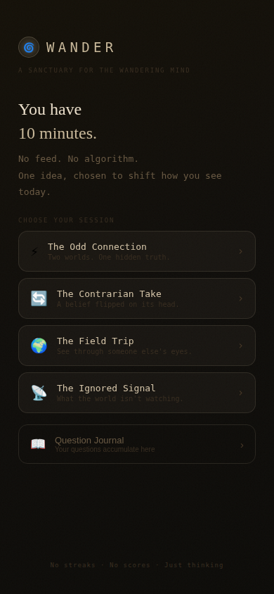

# 🌀 Wander
### *A sanctuary for the wandering mind*

> **One session per day. One idea. No feed. No algorithm. No streaks.**
> Just 10 minutes that leave you thinking differently.

<p align="center">
  
</p>

---

## The Origin Story

This app was born from a simple observation: **the toilet is one of the last unscheduled gaps in modern life.**

Most people grab their phone the moment they sit down. Instead of TikTok or Instagram — which put you in a reactive, scroll-brained state — what if that 10 minutes became the most generative part of your day?

Research on "diffuse thinking" (the mental mode during showers, walks, and pre-sleep) shows this is when the brain makes unexpected connections, surfaces repressed ideas, and achieves insight. We've optimized every other moment of the day. The toilet accidentally survived.

**Wander is not a content app. It's a thinking app.**

---

## Core Philosophy

These principles are non-negotiable. Every product decision should be tested against them.

### 1. One thing per session
Not a feed. Not five articles. One complete idea, delivered with depth. The constraint is the product.

### 2. Incompleteness is a feature
Sessions don't give you the full answer. They give you 70% and let your brain fill the rest during the day. The carry question should echo for hours.

### 3. No gamification
No streaks. No scores. No badges. The moment you add a streak, people optimize for the streak rather than the insight. The reward is the idea itself.

### 4. One session per day
Rationing is not a limitation — it's the value. The daily unlock makes each session feel like an event, not a habit to be mindlessly tapped through. Scarcity creates meaning.

### 5. Private by design
No sharing buttons during the session. No social feed. The toilet context means people are in their most honest, unperformed state. Don't ruin it by making it shareable.

### 6. Serendipity with curation
Not pure algorithm, not pure editorial. The AI generates fresh content each time, but is guided by session type constraints. Feels like stumbling onto something.

---

## Session Types

| Type | Icon | Core idea |
|------|------|-----------|
| **The Odd Connection** | ⚡ | Two completely unrelated things from different domains — one hidden truth connects them |
| **The Contrarian Take** | 🔄 | A widely-held belief, genuinely challenged with evidence. Not conspiracy — intellectual provocation |
| **The Field Trip** | 🌍 | First-person immersion into a niche expert's worldview. See ordinary things differently |
| **The Ignored Signal** | 📡 | Something quietly happening in the world that almost no one is tracking |

Each session ends with a **carry question** — one open, unanswered question you take into the rest of your day.

---

## The Seed Feature

Before each session, users get a soft prompt: *"What's on your mind right now?"*

This is optional. A word, a problem, a feeling. The AI weaves it into the session without making the session *about* you directly. Your career anxiety becomes a Field Trip to an unexpected world that reframes it sideways. Leaving it blank gives pure serendipity.

---

## The Question Journal

Every completed session saves:
- Date
- Session type  
- Session title
- The carry question
- Seed text (if any)
- Session duration

Over weeks and months this becomes a record of your thinking life — not content consumed, but questions you actually walked out the door holding.

---

## PWA Strategy

Wander ships as a **Progressive Web App** rather than a native app. Rationale:

- Zero gatekeeper friction — no App Store review cycle
- Instant iteration — push a fix without resubmission  
- Shareable via URL for early user acquisition
- Installable via "Add to Home Screen" — feels native  
- PWA push notifications on iOS (16.4+) close the re-engagement gap
- No native features are required (no camera, GPS, health sensors)

If the product ever needs deep device integration or App Store distribution for discoverability, revisit native. Don't build it until you hit that ceiling.

---

## Tech Stack

| Layer | Choice | Notes |
|-------|--------|-------|
| Framework | React 18 | Simple, well-supported |
| Build | Vite + vite-plugin-pwa | Fast builds, PWA manifest + service worker auto-generated |
| AI | Claude claude-sonnet-4-20250514 | Via Anthropic API |
| Storage | localStorage (standalone) | See storage.js — swap in any backend |
| Fonts | Cormorant Garamond + DM Mono | Serif elegance + monospace utility |
| Deploy | GitHub Pages | Via GitHub Actions on push to main |

---

## Getting Started

```bash
# 1. Clone
git clone https://github.com/YOUR_USERNAME/wander.git
cd wander

# 2. Install
npm install

# 3. Configure
cp .env.example .env
# Add your Anthropic API key to .env

# 4. Run locally
npm run dev

# 5. Build for production
npm run build
```

### Deploy to GitHub Pages

1. Go to your repo **Settings → Pages → Source** → set to "GitHub Actions"
2. Go to **Settings → Secrets → Actions** → add `VITE_ANTHROPIC_API_KEY`
3. Push to `main` — the workflow in `.github/workflows/deploy.yml` handles the rest

Your app will be live at `https://YOUR_USERNAME.github.io/wander`

---

## Project Structure

```
wander/
├── src/
│   ├── App.jsx              # Main app, all screen state
│   ├── main.jsx             # React entry point
│   ├── constants.js         # Session types, prompts, design tokens
│   ├── storage.js           # Persistence helpers (localStorage / window.storage)
│   ├── api.js               # Anthropic API call
│   └── components/
│       ├── SessionContent.jsx   # Renders each session type
│       └── Journal.jsx          # Question journal screen
├── public/
│   ├── favicon.svg
│   └── icons/               # PWA icons (192px, 512px) — add these!
├── index.html
├── vite.config.js           # Vite + PWA config
├── .github/
│   └── workflows/
│       └── deploy.yml       # Auto-deploy to GitHub Pages
└── .env.example
```

---

## ⚠️ Before Going Public

### Security (Critical)
- [ ] **Move API calls server-side.** `src/api.js` currently calls Anthropic from the browser with `VITE_ANTHROPIC_API_KEY`. This exposes the key in the JS bundle. Before public launch, wrap this in a serverless function (Vercel, Cloudflare Workers, Next.js API routes).
- [ ] Add rate limiting on the server-side wrapper to prevent abuse
- [ ] Add input sanitization on the seed text field

### Assets (Required for PWA)
- [ ] Add `public/icons/icon-192.png` and `public/icons/icon-512.png`
- [ ] Add `public/apple-touch-icon.png` (180×180px)
- [ ] Add `public/favicon.svg`

---

## 📋 Future TODOs

These came out of the original product design conversation and represent the natural next layer of the product. Tackle them roughly in this order:

### Phase 1 — Foundation (pre-launch)
- [x] **Server-side API proxy** — Move Anthropic API call to a backend function. Protect the key.
- [x] **PWA icons** — Create proper icon set (192, 512, maskable). Current placeholder SVG won't install cleanly.
- [x] **Offline graceful degradation** — Show cached last session or a static "thinking" prompt if offline
- [x] **iOS safe area padding** — Handle notch/home indicator with `env(safe-area-inset-*)` 

### Phase 2 — Engagement
- [ ] **PWA push notifications** — Optional morning nudge ("Your session is ready"). Use Web Push API. Requires a backend. No guilt-tripping — one gentle notification, dismissible forever.
- [x] **Onboarding flow** — First-time user experience explaining the philosophy before first session
- [x] **Share a question** — After flushing, option to share just the *carry question* (not full content) as an image. Keeps privacy intact while enabling organic growth.

### Phase 3 — Depth
- [x] **Session history search** — Full-text search within the Question Journal
- [x] **Annual review** — A "year in questions" summary generated by AI from your journal at year end
- [x] **Mood tagging** — After flushing, a single emoji tap for how you felt. No numeric scores. Enables future pattern analysis.
- [x] **Dead Genius mode** — New session type: Take a real problem (from seed) and run it through the lens of a historical thinker (Marcus Aurelius, Buckminster Fuller, etc.)
- [x] **"The Detour" session type** — A random walk: starts with one idea, makes 3 unexpected hops, lands somewhere completely different

### Phase 4 — Monetization (if needed)
- [ ] **Wander Pro** — Unlimited sessions per day, full session history export, custom session type configuration. The free tier (1/day) should always remain free — it's the philosophical core.
- [ ] **Team/company version** — A shared Question Journal for small teams. Weekly digest of what the team was thinking about. Anti-meeting tool.

### Phase 5 — Platform
- [ ] **Native iOS/Android** — Only if PWA push notifications prove insufficient for retention, or App Store discoverability becomes a real growth lever
- [ ] **Apple Watch complication** — Surface today's carry question on the watch face. Passive reminder without opening an app.
- [ ] **Claude Code integration** — Seed sessions from your current coding context. "I'm stuck on X" → session that approaches it from outside software entirely.

---

## Design Language

**Aesthetic direction:** Warm brutalist minimalism. Dark. Candlelit. Deliberate.

- **Primary font:** Cormorant Garamond (serif, editorial, slightly literary)
- **Mono font:** DM Mono (labels, timers, metadata)
- **Color palette:** Near-black backgrounds, warm gold accents (`#c8b89a`), no pure whites
- **Motion:** Slow fade-ups, subtle ripple on the logo orb. Nothing bouncy or gamified.
- **No bright colors.** The UI should feel like picking up a leather notebook, not opening an app.

The design goal: when you close Wander, you don't remember the UI. You remember the question.

---

## Contributing

This project was initially prototyped with Claude. Future development with Claude Code is recommended — the README + code comments are written to give Claude sufficient context to continue without re-explaining the philosophy.

When in doubt: **does this feature make Wander more like a feed, or less?** If more — don't build it.

---

*Built in one conversation. Designed to outlast it.*
